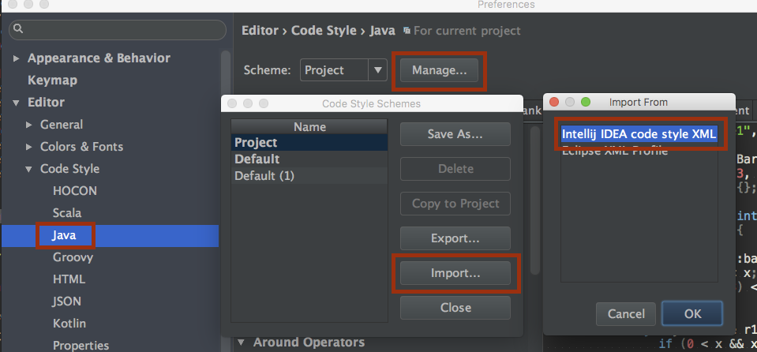

# Java Style Guide

This is Wealthsimple's Java Style Guide. This will cover general-purpose Java conventions, as well as Android and Play Framework-specific conventions.

## Java

We use [Google Java Style Guide](https://google.github.io/styleguide/javaguide.html).

Install [intellij-java-google-style.xml](java/intellij-java-google-style.xml) on IntelliJ:

## Android

Section covering Android-specific Java conventions.
